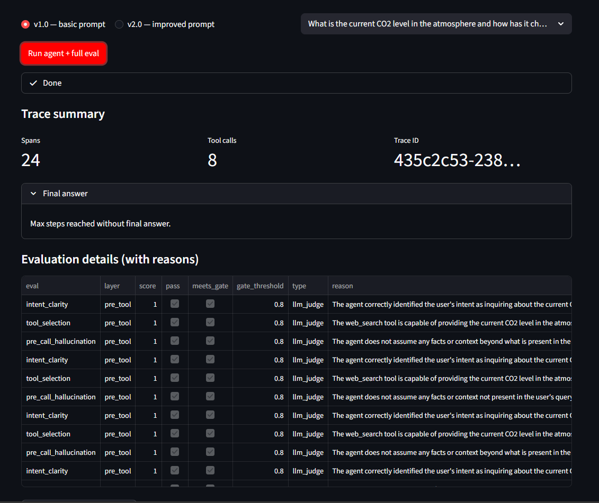

# Agent Evaluation Framework

Multi-layer evaluation for **tool-using agents**: measure quality **before** tool calls (reasoning + tool choice), **at/after** tool calls (parameters, interpretation, next step), and **end-to-end** (goal completion, efficiency, grounded answers).

The agent implementation is **decoupled** from evaluators: you register evals in `evals/eval_definitions.py` and implement logic under `framework/evaluators/`. The demo agent in `agent/research_agent.py` only emits structured **traces**; it does not import eval code.

Inference and LLM-as-judge calls use **Groq**’s OpenAI-compatible **`/chat/completions`** API (`https://api.groq.com/openai/v1`). Every completion call (agent + judges) goes through **`framework/openai_retry.py`** so HTTP **429** responses retry with exponential backoff.

## Features

| Capability | How |
|------------|-----|
| Framework-agnostic traces | Pydantic models in `framework/schema.py` — wire any runtime (LangChain, Bedrock, custom) by producing the same JSON shape |
| Deterministic + model evals | Schema checks + Groq-backed judges |
| Versioned datasets | `framework/dataset.py` → `data/datasets/v{version}.json` |
| Queryable traces | JSON source of truth + **SQLite** index (`data/traces_index.db`) with `query_traces()` |
| Score history | Append-only `data/score_history.jsonl` on each suite run — dashboard shows recent runs |
| Deployment gate | Thresholds in `framework/runner.py` → `python -m framework.cli gate --version v2.0` exits **1** if blocked |
| External tool inspiration | **OpenInference-style** JSONL export for **Arize Phoenix**-class UIs; **Braintrust-shaped** rows in `framework/integrations/braintrust_compat.py` |

## Setup

```bash
cd agent_eval_framework
python -m venv .venv
.venv\Scripts\activate   # Windows
pip install -r requirements.txt
copy .env.example .env   # set GROQ_API_KEY ( https://console.groq.com/keys )
```

Environment variables:

| Variable | Purpose |
|----------|---------|
| `GROQ_API_KEY` | Required for the demo agent and LLM judges |
| `GROQ_BASE_URL` | Default `https://api.groq.com/openai/v1` |
| `GROQ_AGENT_MODEL` | Groq model id for the research agent (default `llama-3.3-70b-versatile`) |
| `GROQ_JUDGE_MODEL` | Groq model id for eval judges (same default; try `llama-3.1-8b-instant` for cheaper judges) |
| `GROQ_REQUEST_DELAY_MS` | Optional pause **before each** Groq call (agent + judge), e.g. `80`, to reduce burst **429**s |
| `GROQ_MAX_RETRIES` | Max retries on 429 / connection errors (default `10`) |
| `GROQ_RETRY_BASE_SEC` | Base backoff seconds for retries (default `2.0`) |

If you see **`tool_use_failed` / tool call validation** from Groq, the stack already uses strict JSON schemas, `parallel_tool_calls=false`, and temperature `0` on tool turns. Try another Groq model via `GROQ_AGENT_MODEL` (e.g. `openai/gpt-oss-20b` often behaves well with tools).

**Interpretation / final-answer turns:** Groq can reject requests if the model emits tools while `tool_choice` is `none`. The agent **flattens** prior `assistant` + `tool` messages into plain text for those calls (see `_flatten_for_text_completion` in `agent/research_agent.py`).

## Quickstart

**Full demo** — Rich terminal UI: prints **available tools**, **benchmark queries**, **eval registry**, then runs agents **query-by-query** with trace summaries, then runs evals **with full judge reasons** per layer:

```bash
python run_demo.py
```

Open `reports/dashboard.html` for scores, deployment gate status, **recent eval suite runs**, and charts.

**Browser UI** (interactive single-query run + eval table + CSV export):

```bash
pip install streamlit   # if not already installed
streamlit run streamlit_app.py
```

After a run you get a **trace summary** (spans, tool calls, trace id), the **final answer** (or a note if the agent hit the step limit), and a sortable **evaluation table** with per-eval scores, gate thresholds, and **LLM judge reasons**.

### Sample output (Streamlit)



### Demo video

Screen recording of the Streamlit **interactive run** (agent + full eval suite) and the resulting trace / evaluation UI:

- **[`Agent_Eval.mp4`](Demo%20VIdeo/Agent_Eval.mp4)** — open or download from the repo file tree, or play locally after clone:  
  `Demo VIdeo/Agent_Eval.mp4`  
  On GitHub’s README, the link opens the file page; use **Download** or your media player for playback (in-browser preview depends on the browser).

**Without API** — synthetic dashboard only:

```bash
python generate_demo_dashboard.py
```

## CLI

Run from this directory (`agent_eval_framework` on `PYTHONPATH`):

```bash
python -m framework.cli gate --version v2.0
python -m framework.cli query --tool web_search --limit 20
python -m framework.cli export-phoenix -o exports/phoenix_spans.jsonl
python -m framework.cli dashboard --versions v1.0 v2.0
python -m framework.cli reindex
```

- **gate** — CI-friendly: exit code **1** if any metric is below `GATE_THRESHOLDS` in `framework/runner.py`.
- **export-phoenix** — NDJSON spans with OpenInference-style fields for Phoenix / offline analysis.
- **query** — SQLite-backed filters (`--agent-version`, `--tool`, `--span-type`).
- **reindex** — Rebuild SQLite from `data/traces.json` if the index is missing or stale.

## Three evaluation layers

1. **Pre-tool** (`framework/evaluators/pre_tool.py`): intent clarity, tool selection (skipped when the model answers without tools), pre-call hallucination.
2. **Post-tool** (`framework/evaluators/post_tool.py`): parameter schema (deterministic), parameter quality, result interpretation, next-step decision.
3. **E2E** (`framework/evaluators/e2e.py`): goal completion, efficiency (deterministic vs `optimal_tool_calls` label), final-answer grounding.

All specs and thresholds are documented in `evals/eval_definitions.py`.

## Datasets and labels

Human labels live in `evals/labels.json` (golden answers, `optimal_tool_calls`, etc.). `DatasetManager.build_from_traces` merges traces with labels into versioned dataset files under `data/datasets/`.

Production sampling workflow (conceptual): export traces → label in UI or spreadsheet → merge into `labels.json` or a new dataset version → re-run `run_suite`.

## Integrations (inspiration)

- **Arize Phoenix / OpenInference**: `framework/integrations/phoenix_export.py` — import NDJSON into Phoenix or adapt to OTLP later.
- **Braintrust-style experiments**: `trace_to_braintrust_row()` for `input` / `output` / `scores` rows.
- **PromptFoo / RAGAS**: use the same trace JSON as offline test cases; judges mirror RAGAS-style rubrics without coupling to those libraries.

## Project layout

```
agent_eval_framework/
  Demo VIdeo/Agent_Eval.mp4  # Screen recording (linked from README)
  Screenshot/image.png        # Sample UI (referenced from README)
  streamlit_app.py           # Browser UI for single-query runs + eval table
  agent/research_agent.py    # Groq demo agent + tool traces
  evals/eval_definitions.py  # Eval registry (documentation + thresholds)
  framework/
    schema.py                # Trace, spans, EvalResult, Dataset
    settings.py              # Groq URL + models + retry tuning
    openai_retry.py          # Shared 429 retry for agent + judges
    tracer.py                # JSON persistence + SQLite index
    trace_index.py           # Queryable span index
    runner.py                # Suite orchestration + deployment gate + score_history append
    dataset.py               # Versioned datasets
    llm_judge.py             # Groq judge helper
    dashboard.py             # Static HTML report
    cli.py                   # Gate, export, query, dashboard
    integrations/            # Phoenix + Braintrust-compat exporters
  data/
    traces.json
    traces_index.db
    eval_results.json
    score_history.jsonl
    datasets/v*.json
  reports/dashboard.html
```

## License

Use and modify freely for evaluation workflows internal to your team.
